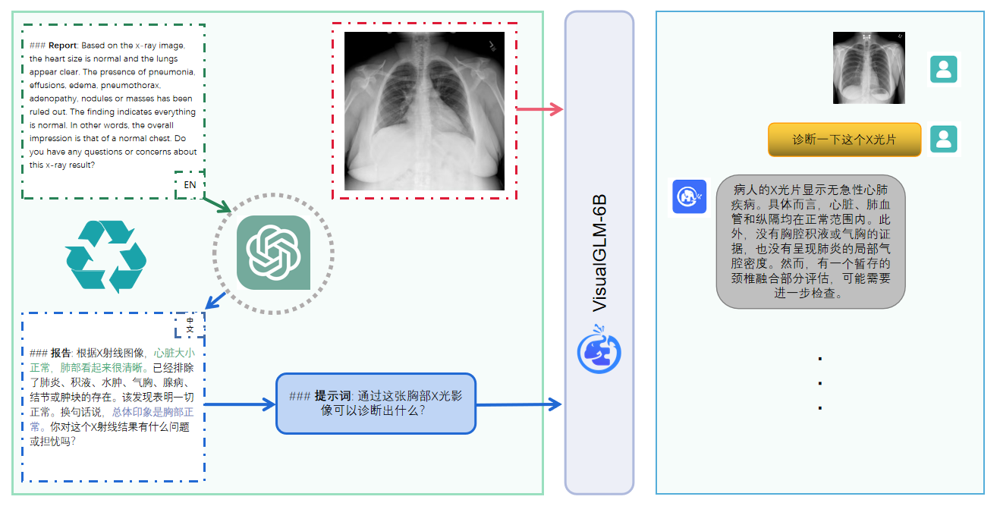
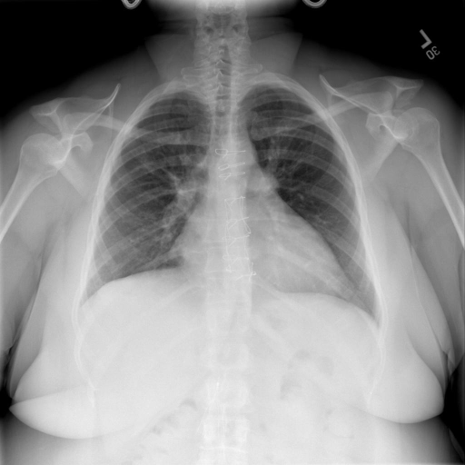
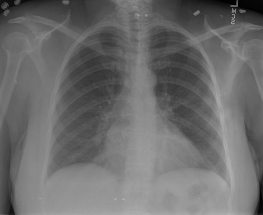
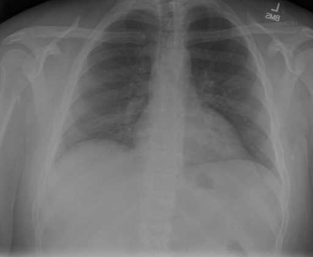
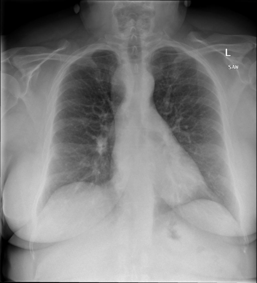

> **Note**
> 
> 在开始看这个项目之前，您应该是以学术研究态度，切不可以实际医疗行为行为评价该项目的标准

## 介绍

最近，通用领域的大语言模型 (LLM)，例如 ChatGPT，在遵循指令和产生类似人类响应方面取得了显著的成功，这种成功间接促进了多模态大模型的研究和发展，如通用领域的多模态大模型[MiniGPT-4](https://github.com/Vision-CAIR/MiniGPT-4)、[mPLUG-Owl](https://github.com/X-PLUG/mPLUG-Owl)、[Multimodal-GPT](https://github.com/open-mmlab/Multimodal-GPT)和[LLaVA](https://github.com/haotian-liu/LLaVA) ，然而，此类多模态大模型却很少出现在医学领域的研究中，阻碍了相关研究发展。[visual-med-alpaca](https://github.com/cambridgeltl/visual-med-alpaca)虽然在医学多模态大模型方面做出了一些很有成效的工作，然而其数据为英文诊断报告，不利于促进中文领域医学多模态大模型的研究发展。为此，我们开发了XrayGLM以解决上述问题。XrayGLM在医学影像诊断和多轮交互对话上显示出了非凡的潜力。

 <p align="center">
      <a href='https://github.com/WangRongsheng/XrayGLM'>
            
      </a>
      <a href='https://github.com/WangRongsheng/XrayGLM'>
            
      </a>
      <a href='https://github.com/WangRongsheng/XrayGLM'>
            
      </a>
      <a href="https://github.com/WangRongsheng/XrayGLM">
        
      </a>
      <a href="https://github.com/WangRongsheng/XrayGLM/blob/main/LICENSE">
        
      </a>
      </br>
      <a href="https://github.com/WangRongsheng/XrayGLM/graphs/contributors">
        
      </a>
      <a href="https://github.com/WangRongsheng/XrayGLM/issues">
        
      </a>
      <a href="https://github.com/WangRongsheng/XrayGLM/pulls">
        
      </a>
      <a href=href="https://github.com/kaixindelele/XrayGLM/stargazers">
        
      </a>
  </p>
  
## 本文贡献



- 借助ChatGPT以及公开的数据集，我们构造了一个`X光影像-诊断报告`对的医学多模态数据集；
- 我们将构建的中文胸部X光片诊断数据集在[VisualGLM-6B](https://github.com/THUDM/VisualGLM-6B)进行微调训练，并开放了部分训练权重用于学术研究；
  
## 数据集

- [MIMIC-CXR](https://physionet.org/content/mimic-cxr-jpg/2.0.0/)是一个公开可用的胸部X光片数据集，包括377,110张图像和227,827个相关报告。
- [OpenI](https://openi.nlm.nih.gov/faq#collection)是一个来自印第安纳大学医院的胸部X光片数据集，包括6,459张图像和3,955个报告。

在上述工作中，报告信息都为非结构化的，不利于科学研究。为了生成合理的医学报告，我们对两个数据集进行了预处理，并最终得到了可以用于训练的**英文报告**。除此之外，为了更好的支持中文社区发展，借助ChatGPT的能力，我们将英文报告进行了中文翻译，并最终形成了可用于训练的数据集。

|数据集|数量|下载链接|
|:-|:-|:-|
|MIMIC-CXR-zh|-|-|
|OpenI-zh|6,423|[诊疗报告(英文)](./data/openi-en.json)、[诊疗报告(中文)](./data/Xray/openi-zh.json) 、[X光影像](https://pan.baidu.com/s/13GBsDMKf6xBZBSHpoWH_EA?pwd=k9sh)|

## 快速上手

1. 安装环境
```bash
# 安装依赖
pip install -r requirements.txt
# 国内换源安装依赖
pip install -i https://mirrors.aliyun.com/pypi/simple/ -r requirements.txt
```
此时默认会安装`deepspeed`库（支持`sat`库训练），此库对于模型推理并非必要，同时部分`Windows`环境安装此库时会遇到问题。 如果想绕过`deepspeed`安装，我们可以将命令改为：
```bash
# 安装依赖
pip install -i https://mirrors.aliyun.com/pypi/simple/ -r requirements_wo_ds.txt
# 安装SwissArmyTransformer
pip install -i https://mirrors.aliyun.com/pypi/simple/ --no-deps "SwissArmyTransformer>=0.3.6"
```
2. 模型推理

|模型权重|下载链接|
|:-|:-|
|checkpoints-XrayGLM-300|-|
|checkpoints-XrayGLM-3000|-|

CLI推理：
```python
python cli_demo.py --from_pretrained checkpoints/checkpoints-XrayGLM-3000 --prompt_zh '详细描述这张胸部X光片的诊断结果'
```
更多[参数](https://github.com/WangRongsheng/XrayGLM/blob/main/cli_demo.py#L16)

## 效果展示

影像诊断：
|X光影像|诊疗报告(医生)|XrayGLM|
|:-|:-|:-|
||根据X射线图像，心脏大小正常，肺部看起来很清晰。已经排除了肺炎、积液、水肿、气胸、腺病、结节或肿块的存在。该发现表明一切正常。换句话说，总体印象是胸部正常。|X光片显示，心脏大小正常。肺部没有气胸或胸腔积液的证据。骨骼结构看起来没有任何异常。总的来说，X光片表明没有发现急性心肺疾病的迹象。|
||X光图片显示没有扭曲的区域、可疑的骨质不透明度或胸腺积液。心脏大小轻微增大，但非常稳定。此外，没有气胸的证据，肺野也正常。总体来说，X光片显示没有急性心脏异常，但要注意轻微的心脏扩大。|X光片显示，心脏大小正常。肺部和纵隔轮廓清晰，没有气胸或胸腔积液的证据。骨骼结构完整，没有任何急性异常。|
||心影形态在正常范围内。没有急性骨质异常。有可能出现没有明显的吸水或肺实质状况的线索。没有大面积积液或气胸。有可能怀疑其有误吸或肺实质问题。为了确诊和治疗，可能需要进行适当的影像学随访。|心脏大小正常，肺部和纵隔轮廓清晰。没有急性异常或活动受限的证据。没有任何明显的气胸、胸腔积液或肺不张的迹象。此外，也没有发现任何局灶性骨质异常或其他急性疾病。|

多轮对话：
|X光影像|诊疗报告(医生)|
|:-|:-|
||右侧主动脉突出观察到。心脏大小正常。胸部未发现明显的肺气肿、胸膜积液或可疑的肺部病变。报告指出已知右侧主动脉情况正常。|

```bash
>> X光影像路径：./data/Xray/861_1.png

>> 用户：这是一张什么图？
>> XrayGLM：这张图片显示的是一张肺部检查的X光片。

>> 用户：请描述这张胸部X光片的诊断结果
>> XrayGLM：心脏大小正常，肺部清晰。没有急性心肺疾病的证据。

>> 用户：是否存在肺气肿？
>> XrayGLM：没有肺气肿。心脏大小正常，肺部清晰。没有发现急性心肺疾病的证据。

>> 用户：平时饮食该注意什么？
>> XrayGLM：饮食应该健康，均衡。建议增加蛋白质的摄入量，因为蛋白质有助于维持肌肉和骨骼的健康。多食用蔬菜、水果、全谷物以及健康的脂肪来源如橄榄油、鱼类等可以帮助获得足够的维生素和矿物质。此外，避免过度饮酒或吸烟，这些习惯可能会对心脏健康产生负面影响。
```

## 未来展望

1. 模型的能力更多来源于数据的支持，`OpenI-zh`作为微调数据集，其数据量足以支持研究，在更广泛的任务和性能表现上，我们认为**在大规模数据集上预训练并在高质量少量数据集上微调是一种可行的方案**；
2. 普遍意义的理解上，视觉多模态模型=视觉模型+语言模型。除了需要关注视觉模型信息与语言模型输出的搭配外，还需要**额外关注到语言模型的加强，在人机的对话中，尤其是医疗语言模型的问答上，除了专业的医疗问题回答，带有人文情怀的有温度的回答更应该是我们追寻的目标**。

## 项目致谢

1. [VisualGLM-6B](https://github.com/THUDM/VisualGLM-6B)为我们提供了基础的代码参考和实现；
2. [MiniGPT-4](https://github.com/Vision-CAIR/MiniGPT-4)为我们这个项目提供了研发思路；
3. ChatGPT生成了高质量的中文版X光检查报告以支持XrayGLM训练；
4. [gpt_academic](https://github.com/binary-husky/gpt_academic)为文档翻译提供了多线程加速；
5. [MedCLIP](https://github.com/RyanWangZf/MedCLIP) 、[BLIP2](https://huggingface.co/docs/transformers/main/model_doc/blip-2) 、[XrayGPT](https://github.com/mbzuai-oryx/XrayGPT) 等工作也有重大的参考意义；


这项工作由[澳门理工大学应用科学学院](https://www.mpu.edu.mo/esca/zh/index.php)硕士生[王荣胜](https://github.com/WangRongsheng) 、[段耀菲](https://github.com/IsBaSO4) 、[李俊蓉](https://github.com/lijunrong0815)完成，指导老师为檀韬副教授、[彭祥佑](http://www.patrickpang.net/)老师。

*特别鸣谢：[USTC-PhD Yongle Luo](https://github.com/kaixindelele) 提供了有3000美金的OpenAI账号，帮助我们完成大量的X光报告翻译工作

## 免责声明

本项目相关资源仅供学术研究之用，严禁用于商业用途。使用涉及第三方代码的部分时，请严格遵循相应的开源协议。模型生成的内容受模型计算、随机性和量化精度损失等因素影响，本项目无法对其准确性作出保证。即使本项目模型输出符合医学事实，也不能被用作实际医学诊断的依据。对于模型输出的任何内容，本项目不承担任何法律责任，亦不对因使用相关资源和输出结果而可能产生的任何损失承担责任。

## 项目引用

如果你使用了本项目的模型，数据或者代码，请声明引用：

```bash
@misc{wang2023XrayGLM,
      title={XrayGLM: The first Chinese Medical Multimodal Model that Chest Radiographs Summarization}, 
      author={Rongsheng Wang, Yaofei Duan, Junrong Li, Patrick Pang and Tao Tan},
      year={2023},
      publisher = {GitHub},
      journal = {GitHub repository},
      howpublished = {\url{https://github.com/WangRongsheng/XrayGLM}},
}
```

## 使用许可

此存储库遵循[CC BY-NC-SA](https://creativecommons.org/licenses/by-nc-sa/4.0/) ，请参阅许可条款。

